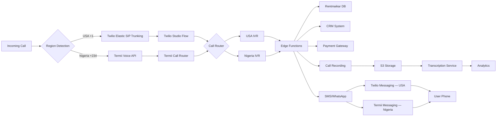

# Rentmaikar Call Infrastructure Architecture - Reference

## Provider Stack

| Component | USA | Nigeria |
|---|---|---|
| **Voice Calls** | Twilio Voice API | Termii Voice API |
| **SMS** | Twilio SMS | Termii SMS |
| **WhatsApp** | Twilio WhatsApp | Termii WhatsApp |
| **OTP** | Twilio Verify | Termii Token |
| **Payments** | PayPal | Paystack |
