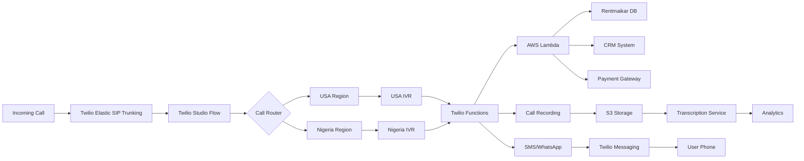

# Rentmaikar Call Infrastructure Architecture - Reference

```mermaid
graph LR
    A[Incoming Call] --> B[Twilio Elastic SIP Trunking]
    B --> C[Twilio Studio Flow]
    
    C --> D{Call Router}
    D --> E[USA Region]
    D --> F[Nigeria Region]
    
    E --> G[USA IVR]
    F --> H[Nigeria IVR]
    
    G --> I[Twilio Functions]
    H --> I
    
    I --> J[AWS Lambda]
    J --> K[Rentmaikar DB]
    J --> L[CRM System]
    J --> M[Payment Gateway]
    
    I --> N[Call Recording]
    N --> O[S3 Storage]
    O --> P[Transcription Service]
    P --> Q[Analytics]
    
    I --> R[SMS/WhatsApp]
    R --> S[Twilio Messaging]
    S --> T[User Phone]
```
