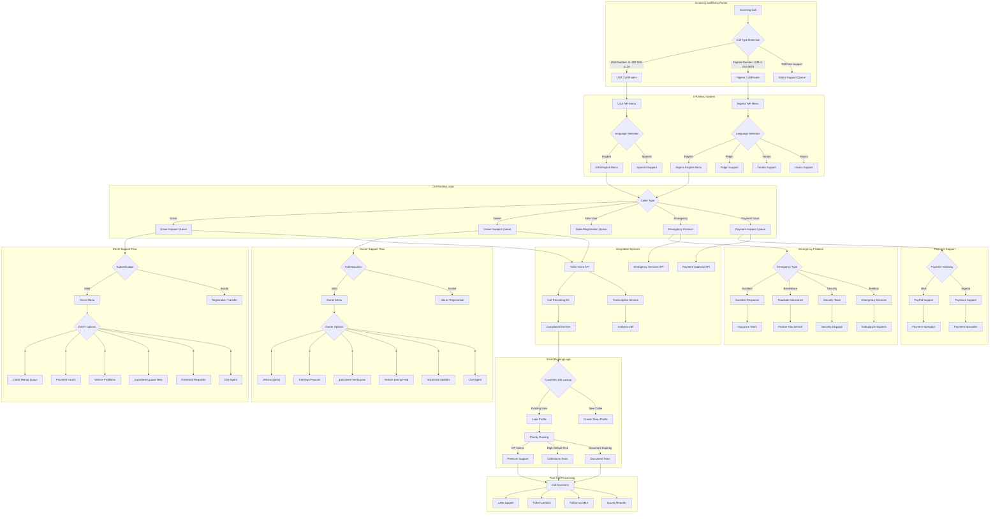

# Rentmaikar Incoming Call Flow

```mermaid
graph TB

    subgraph "Incoming Call Entry Points"
        A[Incoming Call] --> B{Call Type Detection}
        B -->|USA Number +1-202-555-0123| C[USA Call Router]
        B -->|Nigeria Number +234-1-234-5678| D[Nigeria Call Router]
        B -->|Toll-Free Support| E[Global Support Queue]
    end

    subgraph "IVR Menu System"
        C --> F[USA IVR Menu]
        D --> G[Nigeria IVR Menu]
        
        F --> H{Language Selection}
        H -->|English| I[USA English Menu]
        H -->|Spanish| J[Spanish Support]
        
        G --> K{Language Selection}
        K -->|English| L[Nigeria English Menu]
        K -->|Pidgin| M[Pidgin Support]
        K -->|Yoruba| N[Yoruba Support]
        K -->|Hausa| O[Hausa Support]
    end

    subgraph "Call Routing Logic"
        I --> P{Caller Type}
        L --> P
        
        P -->|Driver| Q[Driver Support Queue]
        P -->|Owner| R[Owner Support Queue]
        P -->|New User| S[Sales/Registration Queue]
        P -->|Emergency| T[Emergency Protocol]
        P -->|Payment Issue| U[Payment Support Queue]
    end

    subgraph "Driver Support Flow"
        Q --> V{Authentication}
        V -->|Valid| W[Driver Menu]
        V -->|Invalid| X[Registration Transfer]
        
        W --> Y{Driver Options}
        Y -->|1| Z[Check Rental Status]
        Y -->|2| AA[Payment Issues]
        Y -->|3| AB[Vehicle Problems]
        Y -->|4| AC[Document Upload Help]
        Y -->|5| AD[Extension Requests]
        Y -->|0| AE[Live Agent]
    end

    subgraph "Owner Support Flow"
        R --> AF{Authentication}
        AF -->|Valid| AG[Owner Menu]
        AF -->|Invalid| AH[Owner Registration]
        
        AG --> AI{Owner Options}
        AI -->|1| AJ[Vehicle Status]
        AI -->|2| AK[Earnings/Payouts]
        AI -->|3| AL[Document Verification]
        AI -->|4| AM[Vehicle Listing Help]
        AI -->|5| AN[Insurance Updates]
        AI -->|0| AO[Live Agent]
    end

    subgraph "Emergency Protocol"
        T --> AP{Emergency Type}
        AP -->|Accident| AQ[Accident Response]
        AP -->|Breakdown| AR[Roadside Assistance]
        AP -->|Security| AS[Security Team]
        AP -->|Medical| AT[Emergency Services]
        
        AQ --> AU[Insurance Team]
        AR --> AV[Partner Tow Service]
        AS --> AW[Security Dispatch]
        AT --> AX[Ambulance Dispatch]
    end

    subgraph "Payment Support"
        U --> AY{Payment Gateway}
        AY -->|USA| AZ[PayPal Support]
        AY -->|Nigeria| BA[Paystack Support]
        
        AZ --> BB[Payment Specialist]
        BA --> BC[Payment Specialist]
    end

    subgraph "Integration Systems"
        Q --> BD[Twilio Voice API]
        R --> BD
        T --> BE[Emergency Services API]
        U --> BF[Payment Gateway API]
        
        BD --> BG[Call Recording S3]
        BD --> BH[Transcription Service]
        BG --> BI[Compliance Archive]
        BH --> BJ[Analytics DB]
    end

    subgraph "Smart Routing Logic"
        BI --> BK{Customer 360 Lookup}
        BK -->|Existing User| BL[Load Profile]
        BK -->|New Caller| BM[Create Temp Profile]
        
        BL --> BN[Priority Routing]
        BN -->|VIP Owner| BO[Premium Support]
        BN -->|High Default Risk| BP[Collections Team]
        BN -->|Document Expiring| BQ[Document Team]
    end

    subgraph "Post-Call Processing"
        BO --> BR[Call Summary]
        BP --> BR
        BQ --> BR
        
        BR --> BS[CRM Update]
        BR --> BT[Ticket Creation]
        BR --> BU[Follow-up SMS]
        BR --> BV[Survey Request]
    end
```
