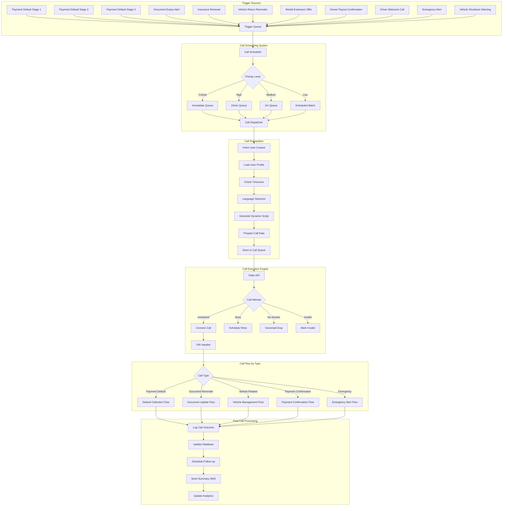
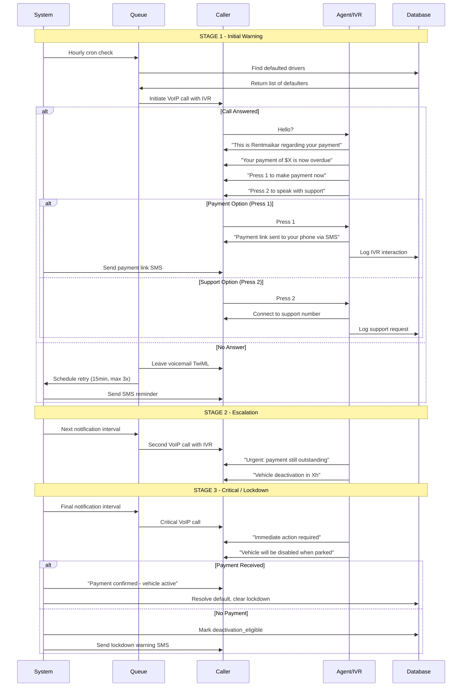

# Rentmaikar Outgoing Call Flow — Reference

## Architecture Overview

## Payment Default Escalation — Detailed Sequence

## Business Rules — Escalation Timing

| Plan Type | Overdue Window | Stage 1 | Stage 2 | Stage 3 (Lockdown) | Consequence |
|---|---|---|---|---|---|
| **Daily** | 24 hours | 8h overdue | 16h overdue | 24h overdue | Daily plan eligibility **permanently revoked** |
| **Weekly** | 36 hours | 12h overdue | 24h overdue | 36h overdue | Downgraded to **Daily plan** permanently |

### Key Enforcement Rules

- **10% administrative fine** on all late payments (driver must consent)
- **Vehicle lockdown** only when telemetry confirms: speed = 0, ignition OFF
- **Payment-to-unlock latency**: Under 30 seconds
- If vehicle is moving at lockdown time: queued and re-checked every 10-15 minutes
- Daily plan eligibility is **permanently revoked** after any default

## Implementation Mapping

### Currently Implemented Triggers

| Trigger | Edge Function | VoIP + IVR? | SMS/WhatsApp? |
|---|---|---|---|
| Payment Default Stage 1 | `process-payment-defaults` | ✅ Press 1/2 IVR | ✅ |
| Payment Default Stage 2 | `process-payment-defaults` | ✅ Press 1/2 IVR | ✅ |
| Payment Default Stage 3 | `process-payment-defaults` | ✅ Press 1/2 IVR | ✅ |
| Document Expiry (30-day) | `process-expiry-notifications` | ✅ IVR (Press 1/2/3) | ✅ Email/SMS/WhatsApp |
| Document Expiry (15-day) | `process-expiry-notifications` | ✅ IVR (Priority) | ✅ Email/SMS/WhatsApp |
| Document Expiry (7-day) | `process-expiry-notifications` | ✅ IVR (Urgent) | ✅ Email/SMS/WhatsApp |
| Document Expiry (5-day) | `process-expiry-notifications` | ✅ Critical Alert + Admin | ✅ + Account Restriction |
| Insurance Renewal (30/15/7/5) | `process-expiry-notifications` | ✅ (all tiers) | ✅ |
| Pre-Due Payment Reminders | `process-predue-reminders` | ❌ | ✅ WhatsApp/Email |
| Emergency (IoT Accident) | `iot-accident-detection` | ❌ (SMS only) | ✅ |

### Edge Functions Involved

| Function | Role |
|---|---|
| `process-payment-defaults` | Hourly cron — escalation, SMS/WhatsApp + VoIP with IVR |
| `payment-default-ivr` | Twilio `<Gather>` callback — handles Press 1 (payment SMS) / Press 2 (connect support) |
| `expiry-notification-ivr` | Twilio `<Gather>` callback — handles Press 1 (upload link SMS) / Press 2 (extension request) / Press 3 (connect agent) |
| `voip-status-callback` | Twilio status webhook — retry logic (3x @ 15min), post-call summary SMS |
| `process-expiry-notifications` | Daily 8 AM UTC — 30/15/7/5-day expiry alerts with VoIP+IVR, document-type routing, account restriction at 5-day |
| `process-predue-reminders` | Hourly — friendly pre-due WhatsApp/email reminders (72h→12h before due) |

### Not Yet Implemented (Blueprint Only)

| Trigger | Notes |
|---|---|
| Vehicle Return Reminder | Requires rental end-date tracking |
| Rental Extension Offer | Requires proactive rental management flow |
| Owner Payout Confirmation | Requires payout processing integration |
| Driver Welcome Call | Requires onboarding automation trigger |
| Vehicle Shutdown Warning | Partially handled via IoT lockdown safety logic |

### Call Execution Flow

1. Edge function creates `voip_calls` record with `status: 'pending'`, `caller_role: 'system'`
2. Twilio REST API called with `<Gather>` TwiML pointing to `payment-default-ivr`
3. Answering Machine Detection enabled (`MachineDetection: DetectMessageEnd`)
4. `StatusCallback` → `voip-status-callback` receives real-time updates
5. On answered: IVR menu plays, driver presses 1 or 2
6. On busy/no-answer: retry scheduled (up to 3x @ 15min intervals)
7. On completion: duration logged, summary SMS sent
8. On max retries exhausted: marked as permanently failed
