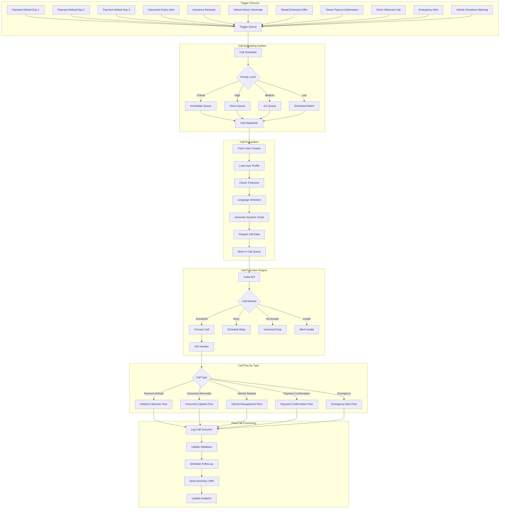

# Rentmaikar Outgoing Call Flow — Reference

## Architecture Overview

## Implementation Mapping

### Currently Implemented Triggers

| Trigger | Edge Function | VoIP Call? | SMS/WhatsApp? |
|---|---|---|---|
| Payment Default Day 1 | `process-payment-defaults` | ❌ | ✅ |
| Payment Default Day 2 | `process-payment-defaults` | ❌ | ✅ |
| Payment Default Day 3 (Final Notice) | `process-payment-defaults` | ✅ | ✅ |
| Document Expiry (30-day) | `process-expiry-notifications` | ❌ | ✅ Email/SMS/WhatsApp |
| Document Expiry (7-day) | `process-expiry-notifications` | ✅ | ✅ Email/SMS/WhatsApp |
| Insurance Renewal (30/7-day) | `process-expiry-notifications` | ✅ (7-day) | ✅ |
| Pre-Due Payment Reminders | `process-predue-reminders` | ❌ | ✅ WhatsApp/Email |
| Emergency (IoT Accident) | `iot-accident-detection` | ❌ (SMS only) | ✅ |

### Not Yet Implemented (Blueprint Only)

| Trigger | Notes |
|---|---|
| Vehicle Return Reminder | Requires rental end-date tracking |
| Rental Extension Offer | Requires proactive rental management flow |
| Owner Payout Confirmation | Requires payout processing integration |
| Driver Welcome Call | Requires onboarding automation trigger |
| Vehicle Shutdown Warning | Partially handled via payment default lockdown |

### Call Scheduling

- **Immediate (Critical)**: Payment Default Day 3, Emergency alerts
- **Cron-based (Scheduled)**: Expiry notifications (daily 8 AM UTC), Payment defaults (hourly), Pre-due reminders (hourly)

### Retry Logic (voip-status-callback)

- `busy` / `no-answer` → Auto-retry up to **3 attempts** within 1 hour
- Retry interval: **15 minutes** between attempts
- After max retries: Call marked as failed, no further retries

### Post-Call Processing (voip-status-callback)

- **Call Outcome**: Logged via `voip_calls` table (status, duration, ended_at)
- **Participant Updates**: Status tracked in `voip_call_participants`
- **Summary SMS**: Sent automatically after completed calls >5 seconds
- **Database Updates**: Call record updated with Twilio SID, duration, recording URL

### Call Execution Flow

1. Edge function creates `voip_calls` record with `status: 'pending'`
2. Twilio REST API called with dynamic TwiML script
3. `StatusCallback` → `voip-status-callback` receives real-time updates
4. On completion: duration logged, summary SMS sent, analytics updated
5. On failure: retry scheduled (up to 3x) or marked as permanently failed
