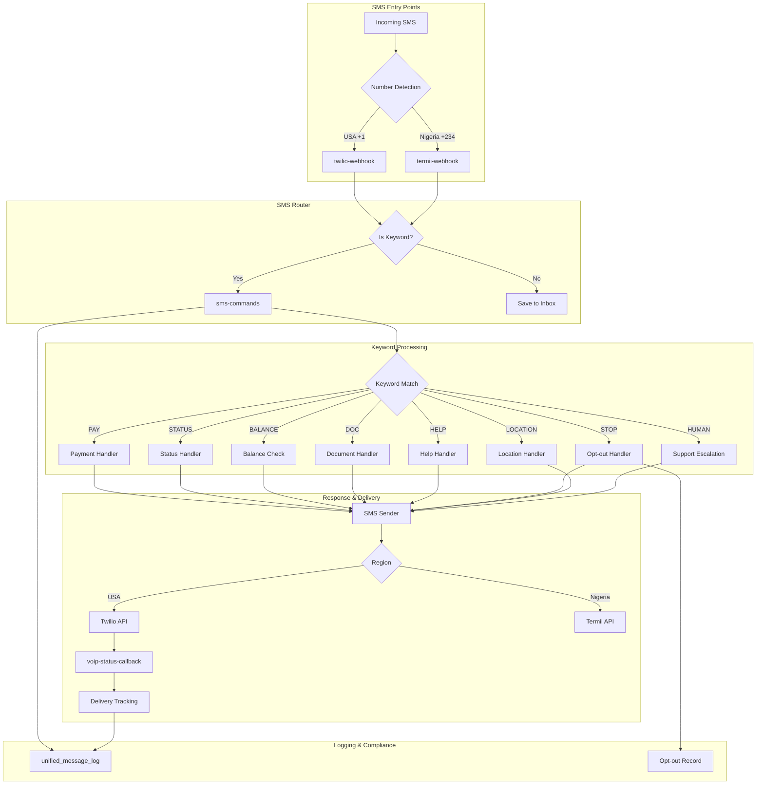

# Rentmaikar SMS Messaging Flow - Reference

## SMS Entry Points

| Entry | Provider | Handler |
|---|---|---|
| USA (+1) | Twilio Webhook | `twilio-webhook` → `sms-commands` |
| Nigeria (+234) | Termii Webhook | `termii-webhook` → `sms-commands` |

## SMS Keywords

| Keyword | Action | Response |
|---|---|---|
| **PAY** | Payment handler | Shows amount due + payment link |
| **STATUS** | Status handler | Active rental details |
| **BALANCE** | Balance check | Outstanding balance summary |
| **DOC** / **DOCS** | Document handler | Missing/pending doc count + upload link |
| **HELP** | Help handler | Full command list |
| **STOP** | Opt-out handler | Disables SMS, sends confirmation |
| **START** | Opt-in handler | Re-enables SMS notifications |
| **LOCATION** | Location handler | Acknowledges location received |
| **DONE** | Confirmation | "Thank you" acknowledgment |
| **4** / **HUMAN** | Support escalation | Creates inbox conversation, connects agent |

## Message Templates (SMS-friendly, ≤160 chars)

```javascript
const smsTemplates = {
  paymentDue: (amount, vehicle, link) =>
    `Rentmaikar: ${amount} due for ${vehicle}. Pay now: ${link} Reply BALANCE for details.`,

  rentalStatus: (vehicle, rate, freq) =>
    `Rentmaikar: Active rental - ${vehicle} at ${rate}/${freq}. Reply PAY to pay or BALANCE for breakdown.`,

  balance: (amount) =>
    `Rentmaikar: Outstanding balance: ${amount}. Reply PAY to settle now.`,

  docStatus: (pending, missing) =>
    `Rentmaikar: Docs - ${missing} missing, ${pending} pending review. Upload at rentmaikar.lovable.app/driver/dashboard`,

  help: () =>
    `Rentmaikar: Commands - PAY: Pay now, STATUS: Rental info, BALANCE: Check due, DOC: Upload docs, STOP: Opt out. Call +1-608-384-3932`,

  optOutConfirm: () =>
    `Rentmaikar: You've been opted out of SMS notifications. Reply START to re-subscribe.`,

  supportConnecting: () =>
    `Rentmaikar: Connecting you to support. An agent will respond shortly. Hours: 8AM-10PM daily.`,

  postCall: (caseId) =>
    `Rentmaikar: Thank you for calling. Case #${caseId}. We'll follow up within 24 hours. Reply HELP for assistance.`,

  emergencyFollowUp: (eta) =>
    `Rentmaikar: EMERGENCY RESPONSE - Help dispatched to your location. ETA: ${eta}. Stay safe.`,
};
```

## Architecture



## Retry & Delivery

- **Max Retries**: 3 attempts with exponential backoff (2s, 4s)
- **Failure Escalation**: Creates urgent inbox_conversations for admin review
- **Delivery Tracking**: Twilio StatusCallback → `voip-status-callback` → updates inbox_messages & unified_message_log
- **Opt-out Compliance**: STOP/START keywords update `profiles.notification_sms`, responses blocked when opted out
