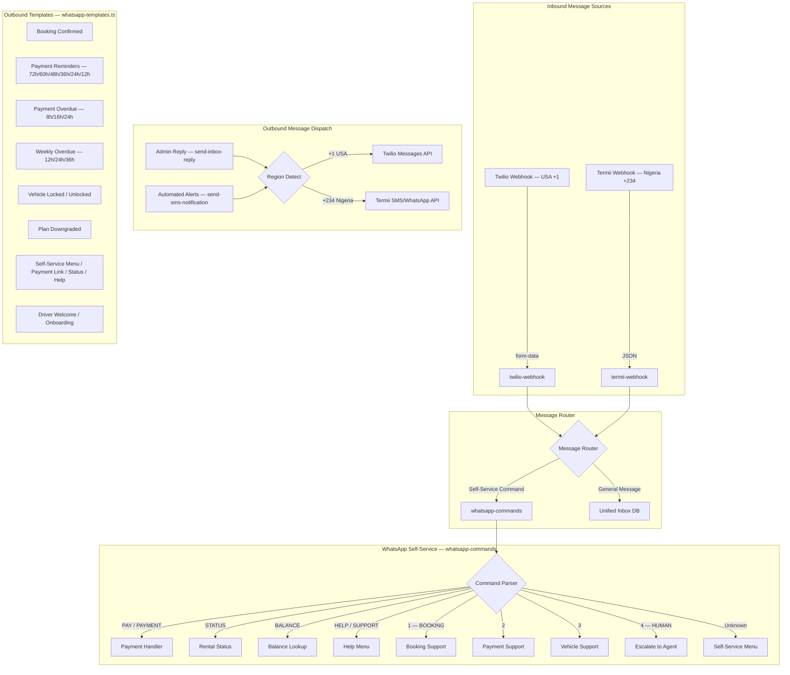

# Rentmaikar WhatsApp Messaging Flow — Reference

## Architecture Overview



## Provider Stack

| Component | USA (+1) | Nigeria (+234) |
|---|---|---|
| **Inbound Webhook** | `twilio-webhook` (form-data) | `termii-webhook` (JSON) |
| **Outbound SMS** | Twilio Messages API | Termii `/api/sms/send` |
| **Outbound WhatsApp** | Twilio `whatsapp:` prefix | Termii `channel: "whatsapp"` |
| **Self-Service Commands** | `whatsapp-commands` (via Twilio) | `whatsapp-commands` (via Termii) |
| **Admin Replies** | `send-inbox-reply` → Twilio | `send-inbox-reply` → Termii |

## Inbound Flow

### USA (+1) — Twilio
1. User sends WhatsApp/SMS to Twilio number
2. Twilio POSTs form-data to `twilio-webhook`
3. Webhook detects channel (`whatsapp:` prefix → WhatsApp)
4. Message saved to `inbox_conversations` + `inbox_messages`
5. Realtime subscription notifies admin Unified Inbox

### Nigeria (+234) — Termii
1. User sends WhatsApp/SMS to Termii number
2. Termii POSTs JSON to `termii-webhook`
3. Webhook normalizes phone to `+234...` format
4. If message is a known command → forwards to `whatsapp-commands`
5. Otherwise → saves to `inbox_conversations` + `inbox_messages`
6. Realtime subscription notifies admin Unified Inbox

## Outbound Flow

### Admin Replies (send-inbox-reply)
```
Admin types reply in Unified Inbox
  → Frontend calls send-inbox-reply edge function
    → Detects phone region:
      +234 → Termii /api/sms/send (channel: "whatsapp" or "generic")
      +1   → Twilio Messages API (whatsapp: prefix or SMS)
    → Updates inbox_messages with external_id + provider metadata
```

### Automated Notifications (send-sms-notification)
```
Edge function triggers notification (e.g., payment reminder)
  → Calls send-sms-notification with phone + channel + type
    → Detects phone region:
      +234 → Termii
      +1   → Twilio
    → Sends message using regional provider
```

## Self-Service Commands (whatsapp-commands)

| Command | Action |
|---|---|
| `PAY` / `PAYMENT` | Generate secure payment link |
| `STATUS` | Show active rental details |
| `BALANCE` | Show outstanding payment balance |
| `HELP` / `SUPPORT` | Display help menu |
| `OK` / `DONE` | Acknowledge confirmation |
| `1` / `BOOKING` | Booking support info |
| `2` | Payment support info |
| `3` | Vehicle support info |
| `4` / `HUMAN` | Escalate to live agent → creates inbox conversation |
| *Unknown* | Display self-service menu |

## Message Templates

All templates are defined in `supabase/functions/_shared/whatsapp-templates.ts` and include:

- **Booking**: Confirmed, Owner Notified, Pickup Reminder, Return Reminder
- **Pre-Due Reminders**: 72h, 60h, 48h, 36h, 24h, 12h before payment due
- **Overdue (Daily)**: 8h, 16h, 24h final warning
- **Overdue (Weekly)**: 12h, 24h, 36h final warning
- **Lockdown**: Vehicle locked, Vehicle unlocked, Plan downgraded
- **Self-Service**: Menu, Payment link, Rental status, Help, Driver welcome

## Edge Function Config (config.toml)

```toml
[functions.twilio-webhook]
verify_jwt = false

[functions.termii-webhook]
verify_jwt = false

[functions.whatsapp-commands]
verify_jwt = false
```

All inbound webhooks have JWT verification disabled to allow unauthenticated delivery from external providers.

## Secrets Required

| Secret | Provider | Usage |
|---|---|---|
| `TWILIO_ACCOUNT_SID` | Twilio | USA outbound messages |
| `TWILIO_AUTH_TOKEN` | Twilio | USA outbound auth |
| `TWILIO_PHONE_NUMBER` | Twilio | USA sender number |
| `TERMII_API_KEY` | Termii | Nigeria outbound messages |
| `TERMII_SENDER_ID` | Termii | Nigeria sender ID (default: "Rentmaikar") |
